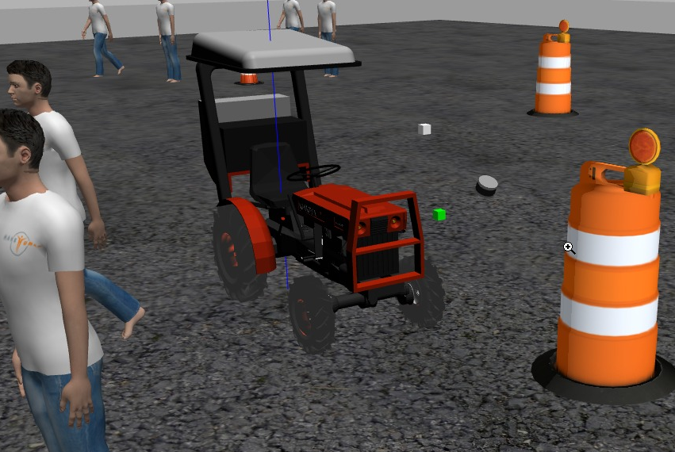
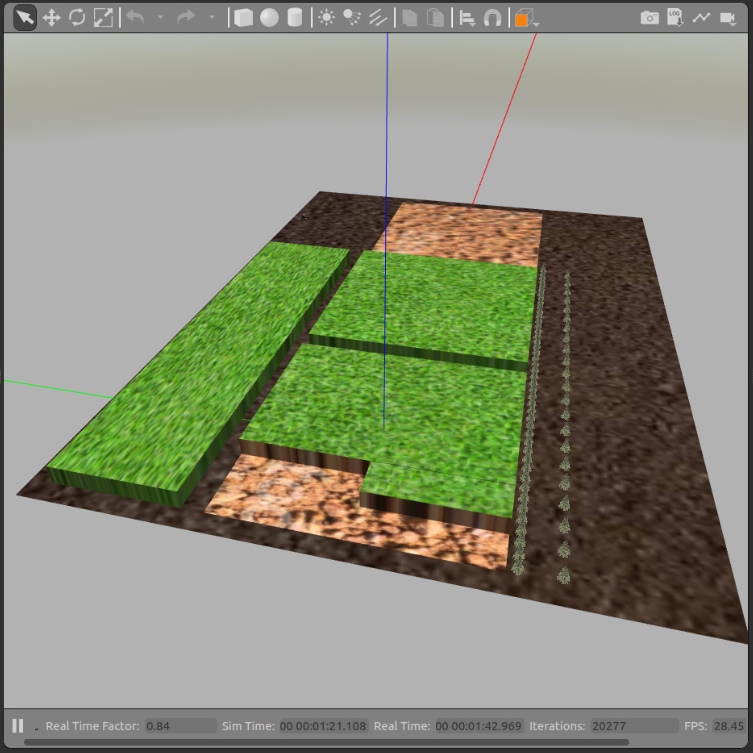
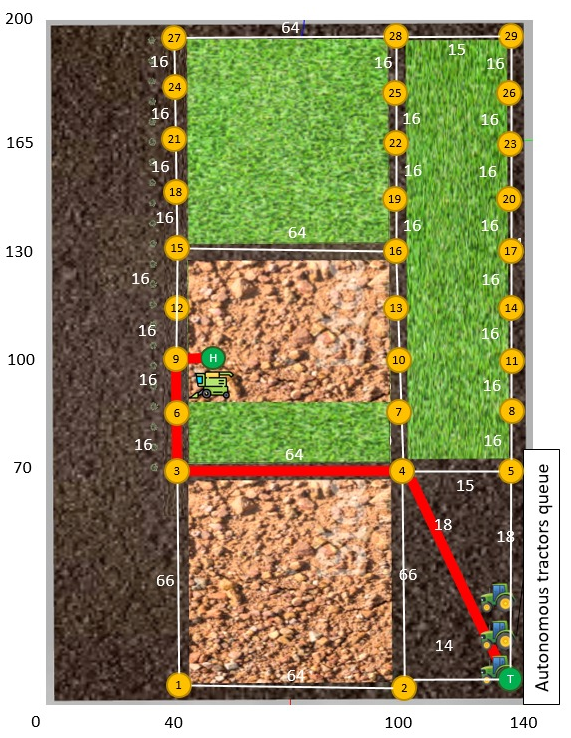

# Routing Optimization Platform for Autonomous Tractors
## Introduction
This software is part of the Automomous Mobile Robots program teached in the Federal Universify of São Carlos.

The main goal of this work is to create a platform for route optmization of autonomous tractors. Autonomous tractors are part of a great trending topic in agriculture where the evolution is constant. The reason why is that in agriculture most of the time humans work in very hazardouns environments. On top of that, crop fields in some cases are huge and farmers are constanly looking for ways to improve their operation to maximize profit. These are the two big motivations for this work once it is understood that automation in the agriculture segment has yet a lot of opportunities although the big steps we have seen over the last decades.

Today it is hard to think of sugar cane manual harvesting as in the future people will have trouble to think of humans operating tractors.

### The tractor
The tractor simulator is based on ackermann steering geometry. However it brings us some challenges when compared to other robots it also puts us in a simulation scenario very close to the reality.




### The simulation environment
The simulations environment used is the combinarion of ROS and Gazebo. A world was built inspired by a generic customer scenario.



Although fairly simple this should be enough for the evaluation of most of the possible trouble situations these machines will face in the field on a real world.

### Route Planning Vertexes
The picture below shows how the vertexes are strategically placed to later integrate the vertexes matrix used by the route planning algorithm.



Today the costs are basically connected to the distance between the vertexes however it can have the influece of other variables such as road blocks, busy segments or anything else that is particular to that operation or moment.


## Getting Started

### Pre requisites
Ubuntu 18.04.5 LTS (Bionic Beaver)

ROS Melodic (Morenia)

#### Setting up ROS Melodic "Morenia"

**1. Install the dependencies step to step.**

```console
sudo apt install python3-pip
sudo apt-get install python-rosdep
```

**1.1 Install ROS Melodic following all the steps taken [here]** http://wiki.ros.org/melodic/Installation/Ubuntu

Install a ROS velodyne simulator package:
```console
* $ sudo apt-get install ros-melodic-velodyne-simulator
```
**1.2 Create a ROS Workspace.**
```console
mkdir -p ~/catkin_ws/src
cd ~/catkin_ws/
catkin_make
source devel/setup.bash
```

**note:** if catkin command (catkin_make) does not work try:
```console
sudo apt-get install ros-melodic-catkin
```

#### Setting up ROS tractor_sim simulation

**2. Install the dependencies for simulation step to step.**

**2.1 state_controller**
```console
cd ~/catkin_ws/src
git clone https://github.com/olinrobotics/state_controller.git
cd ..
rosdep install -iry --from-paths src
cd ~/catkin_ws/
catkin_make
source devel/setup.bash
```

**2.2 GRAVL - install with the following all the steps taken [here]** https://github.com/olinrobotics/gravl

**2.3 tractor_sim_packages**
```console
cd ~/catkin_ws/src
git clone https://github.com/olinrobotics/tractor_sim_packages.git
cd ..
rosdep install -iry --from-paths src
cd ~/catkin_ws/
catkin_make
source devel/setup.bash
```

**2.4 tractor_sim**
```console
cd ~/catkin_ws/src
git clone https://github.com/olinrobotics/tractor_sim.git
cd ..
rosdep install -iry --from-paths src
cd ~/catkin_ws/
catkin_make
source devel/setup.bash
```

**Note:** To use the models included in this repo, copy the contents of the folder to ~/.gazebo/models
```console
cd ~/catkin_ws/src/tractor_sim/tractor_sim_gazebo/models
cp -R . ~/.gazebo/models
```

### Installation
Once you installed tractor_sim and all its dependencies you are ready to install ropat package.

Go to your src folder, clone and build it by following the steps below:
```console
cd ~/catkin_ws/src/
git clone https://github.com/egnascimento/ropat.git
catkin build
cd ..
source devel/setup.bash
```

These procedures shoule be enough for you to get the rest of the environment ready to go.

## Usage
To run simulation:
```console
roslaunch ropat ropat.launch
```

## Roadmap
There are still many opportunites to foster the development of this work. Although it has a very practical approach in terms of applying theoretical concepts and optmization algorithms to a simulation environment, there are still some challenges to overcome such as the setup of multiagent ackermann based vehicles. This platform should be fully reused for this goal as well as other future work related to route and path planning optmization specially in the agriculture scenario.
There is also opportunity here for harvesting simulation however during our research we have not found any harvester model which is also a great oportunity from our point of view.

## Acknowledgments
- Ariel Campos
- Eduardo Mota
- Eduardo Nascimento
- Prof. Dr. Kelen Vivaldini
- Lidia Rocha
- Publio Elon

Also
- Teams responsible for the tractor simulator and all dependencies.
- The ROS, gazebo, robotics and simulation community whose papers inspired and helped us to do this work.

